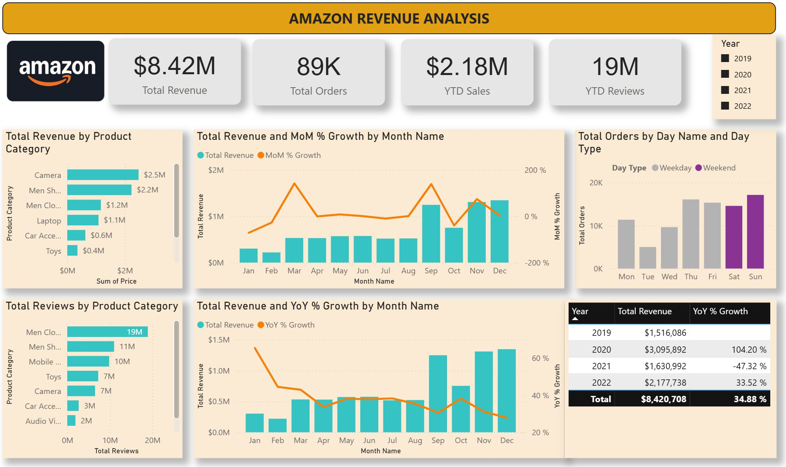

# 📊 Amazon Revenue Analysis

## 📌 Project Overview
This project analyzes **89k+ Amazon sales records** to uncover revenue trends, customer engagement patterns, and category-level insights.  
The analysis was performed using **MySQL** for data preparation and querying, and **Power BI** for interactive dashboards and KPI visualization.  

## 🔑 Key Features
- ETL and data preparation with **MySQL**
- Built KPIs such as:
  - Year-to-Date (YTD), Month-to-Date (MTD), and Quarter-to-Date (QTD) Sales
  - Month-over-Month (MoM) Revenue Growth
  - Revenue per Review & Review-to-Sales Ratio
- Customer engagement analysis (reviews by category, weekend vs weekday orders, etc.)
- Interactive Power BI dashboard for decision-making  

## 🛠️ Tools & Technologies
- **SQL (MySQL)** – Data cleaning, transformation & queries  
- **Power BI** – Dashboard design & visualization  
- **GitHub** – Project version control & documentation  

## 📷 Dashboard Preview
  
 

## 🚀 Insights & Impact
- Identified **top-performing product categories** and revenue drivers  
- Showcased **customer engagement trends** via reviews and order patterns  
- Delivered **actionable KPIs** to evaluate performance across time periods  

## 📌 Future Work
- Extend analysis with cost data to calculate **profit margins**  
- Build **Tableau engagement dashboard** for comparative study  
- Automate ETL pipeline for real-time reporting  

---
👤 **Author**: *[Farwah Hasnain]*  
📧 Contact: [farwah.hasnain@gmail.com] | 🌐 [LinkedIn](https://www.linkedin.com/in/farwah-hasnain/)

